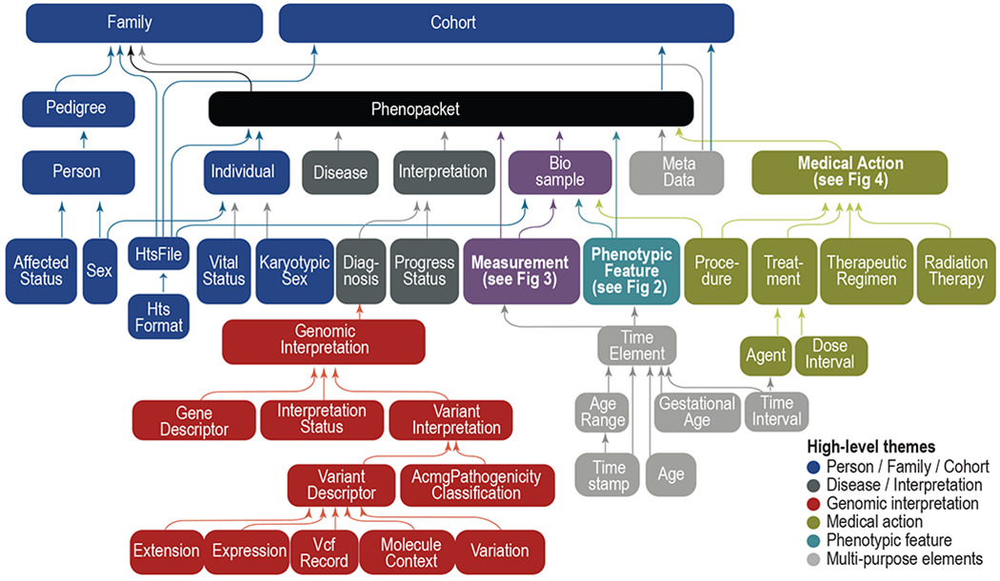
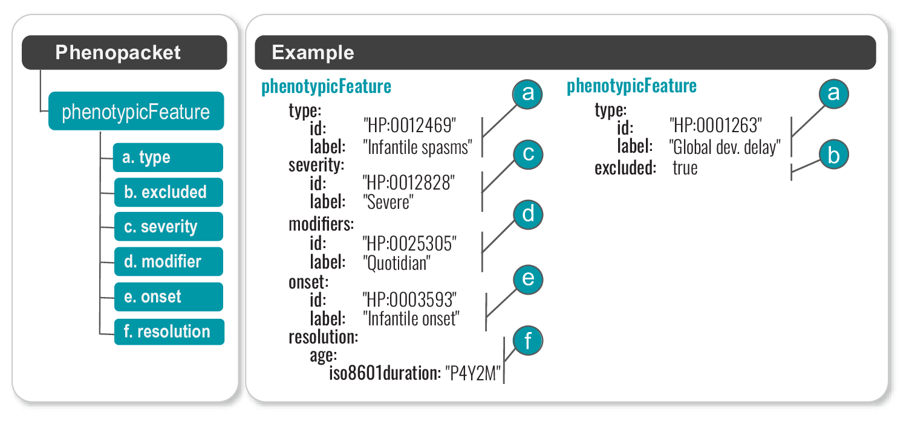

# GA4GH Phenopackets

The Global Alliance for Genomics and Health ([GA4GH](https://www.ga4gh.org/){:target="\_blank"}) is a standards-setting organization that is developing a suite of coordinated standards for genomics. The GA4GH Phenopacket Schema is a standard for sharing disease and phenotype information that characterizes an individual person or biosample ([Jacobsen et al., 2022](https://pubmed.ncbi.nlm.nih.gov/35705716/){:target="\_blank"}).

## Introduction

The Phenopacket Schema is flexible and can represent clinical data for any kind of human disease including rare disease, complex disease, and cancer. It also allows consortia or databases to apply additional constraints to ensure uniform data collection for specific goals.

<figure markdown>
{ width="600" }
<figcaption><b>Phenopacket schema overview</b>.
The GA4GH Phenopacket schema consists of several optional elements, each of which contains information about a certain topic, such as phenotype, variant, or pedigree. An element can contain other elements, which allows a hierarchical representation of data. For instance, Phenopacket contains elements of type Individual, PhenotypicFeature, Biosample, and so on. Individual elements can therefore be regarded as building blocks that are combined to create larger structures.
</figcaption>
</figure>

## Tutorial

We have published a detailed example and tutorial for how to encode the clinical data of an individual with a Mendelian rare disease (retinoblastoma) in [Ladewig et al. 2022](https://pubmed.ncbi.nlm.nih.gov/36910590/){:target="\_blank"}.

The schema is available on its [GitHub repository](https://github.com/phenopackets/phenopacket-schema){:target="\_blank"} in addition to detailed [documentation](https://phenopacket-schema.readthedocs.io/en/latest/){:target="\_blank"}.

## Phenopackets and HPO

The GA4GH Phenopacket Schema allows more context to be provided for phenotypic abnormalities than a list of HPO terms without additional data. For instance, we can specify the age of onset, the severity, the resolution (abatement, or “offset”) of a feature, other modifiers from the HPO’s [Clinical Modifier](https://hpo.jax.org/app/browse/term/HP:0012823){:target="\_blank"}  subontology, and also provides a standard syntax for reporting that a particular feature was explicitly excluded by clinical examination.

<figure markdown>
{ width="600" }
<figcaption><b>Overview of the PhenotypicFeature element of the GA4GH Phenopacket Schema.</b>.
</figcaption>
</figure>

We have provided recommendations of how to encode clinical data with HPO terms that can be used as a guide to creating phenopackets for individuals with rare disease ([Oien et al., 2019](https://pubmed.ncbi.nlm.nih.gov/31479590/){:target="\_blank"}).

## Creating Phenopackets: PhenopacketLab

PhenopacketLab is an Angular/Springboot web application for the loading, editing, saving of data that follows the Phenopacket Schema.
PhenopacketLab is available on GitHub.

## Creating Phenopackets for developers

Phenopacket-tools is an open-source Java library and command-line application for construction, conversion, and validation of phenopackets. Phenopacket-tools simplifies construction of phenopackets by providing concise builders, programmatic shortcuts, and predefined building blocks (ontology classes) for concepts such as anatomical organs, age of onset, biospecimen type, and clinical modifiers.
The phenopacket-tools library is freely available on GitHub. An article describing phenopacket-tools was published (Danis et al., 2023).
A python package for working with phenopackets is generated directly from the Protobuf framework and is available on PyPI: phenopackets. A Rust crate is also available to build from the rust-build branch of the schema repository.

The library pyphetools is intended to simplify the creation of phenopackets from tabular data or relational databases by providing a number of convenience functions and quality control measures.

## Phenopackets on FHIR

A Fast Healthcare Interoperability Resources (FHIR) Implementation Guide (IG) is being developed as a wy of working with phenopackets in electronic health record (EHR) settings: core-ig. The IG is being developed under the aegis of the HL7 Vulcan Accelerator program.

## Using phenopackets for HPO-driven genomic diagnostics

Exomiser and LIRICAL are software packages for prioritizing variants and genes in the genomic diagnostics of rare Mendelian disease. Both packages have adopted the GA4GH Phenopacket Schema as an input format.
